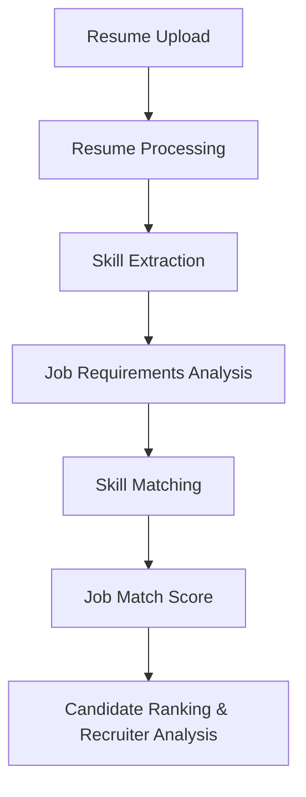
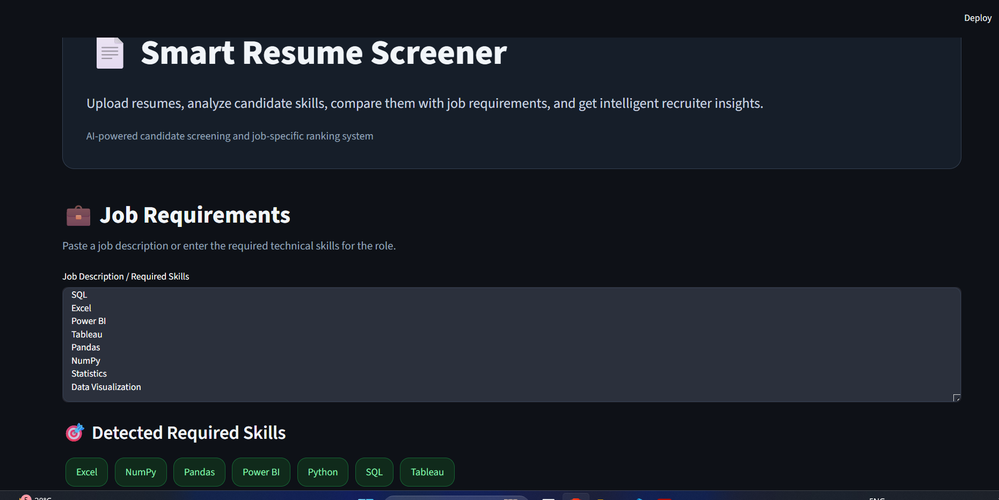
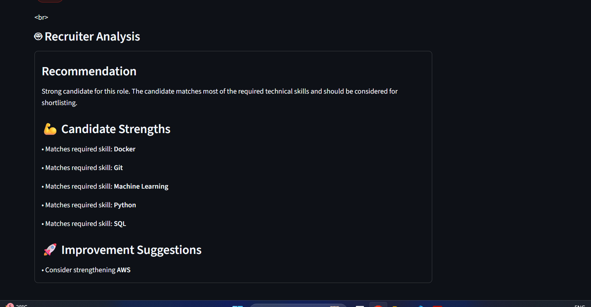
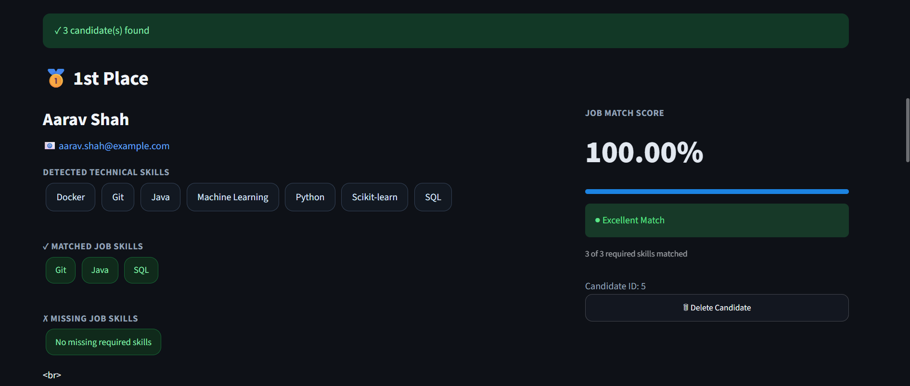
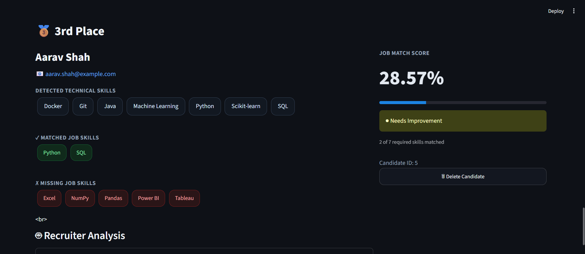

# Smart Resume Screener

An AI-powered resume screening and candidate ranking system built using **Python, FastAPI, and Streamlit**.

The application allows recruiters to upload candidate resumes, specify job requirements, automatically extract technical skills, compare candidates with the required skills, and rank them based on a job match score.

---

## Features

- Upload and process candidate resumes
- Extract candidate details and technical skills
- Enter job descriptions or required skills
- Automatically detect required job skills
- Compare candidate skills with job requirements
- Calculate a job match score
- Rank multiple candidates
- View matched and missing skills
- Interactive recruiter dashboard using Streamlit
- REST API using FastAPI

---

## Project Workflow



---

## Tech Stack

### Backend
- Python
- FastAPI
- SQLAlchemy
- Pydantic

### Frontend
- Streamlit

### Resume Processing
- PyPDF2

### Database
- SQLite

---

## Project Architecture

```text
Smart-Resume-Screener/
│
├── backend/
│   ├── app/
│   │   ├── api/
│   │   │   ├── candidate.py
│   │   │   └── resume.py
│   │   │
│   │   ├── models/
│   │   │   └── candidate.py
│   │   │
│   │   ├── schemas/
│   │   │   └── candidate.py
│   │   │
│   │   ├── services/
│   │   │   └── scoring.py
│   │   │
│   │   ├── database.py
│   │   └── main.py
│   │
│   ├── uploads/
│   └── requirements.txt
│
├── frontend/
│   └── app.py
│
├── sample_data/
│   └── ...
│
├── screenshot/
│   ├── dashboard.png
│   ├── analysis.png
│   ├── ranking.png
│   └── ranking2.png
│
├── .gitignore
├── candidates.json
└── README.md
```

---

## Application Screenshots

### Dashboard



The dashboard allows recruiters to enter job requirements and automatically identify the required technical skills.

### Candidate Analysis



The system extracts candidate information and technical skills from the uploaded resume and compares them with the job requirements.

### Candidate Ranking



Candidates are ranked based on their calculated job match score.

### Additional Ranking View



Recruiters can analyze candidate skills, matched skills, missing skills, and overall job compatibility.

---

## How It Works

### 1. Upload Resume

Recruiters upload candidate resumes in PDF format.

### 2. Resume Processing

The system extracts relevant information from the uploaded resume.

### 3. Skill Extraction

Technical skills are identified from the resume content.

### 4. Job Requirements Analysis

The recruiter enters a job description or required technical skills.

### 5. Skill Matching

Candidate skills are compared with the skills required for the job.

### 6. Job Match Score

A match score is calculated based on the candidate's matched and missing skills.

### 7. Candidate Ranking

Multiple candidates can be compared and ranked according to their job match score.

---

## Running the Project Locally

### Clone the repository

```bash
git clone https://github.com/ramkirubhakaranprakash/Smart-Resume-Screener.git
cd Smart-Resume-Screener
```

### Create a virtual environment

```bash
python -m venv venv
```

### Activate the virtual environment

#### Windows

```bash
venv\Scripts\activate
```

#### Linux / macOS

```bash
source venv/bin/activate
```

### Install dependencies

```bash
pip install -r backend/requirements.txt
```

---

## Run the FastAPI Backend

```bash
cd backend
uvicorn app.main:app --reload
```

The API will run at:

```text
http://127.0.0.1:8000
```

API documentation:

```text
http://127.0.0.1:8000/docs
```

---

## Run the Streamlit Frontend

Open a new terminal, activate the virtual environment, and run:

```bash
streamlit run frontend/app.py
```

The application will open in your browser.

---

## Key Functionalities

- Resume upload and storage
- Resume text extraction
- Candidate information processing
- Technical skill extraction
- Job requirement analysis
- Required skill detection
- Candidate-to-job skill comparison
- Job match score calculation
- Candidate ranking
- Missing skill identification
- Recruiter dashboard
- FastAPI REST API

---

## Future Improvements

- NLP-based semantic resume analysis
- Machine learning-based candidate scoring
- Support for DOCX resumes
- Resume similarity scoring
- PostgreSQL database integration
- Authentication and recruiter accounts
- Docker containerization
- Cloud deployment
- Advanced analytics dashboard

---

## Author

**Ram Kirubhakaran Prakash**

Computer Science Student

---

## License

This project is created for educational and portfolio purposes.